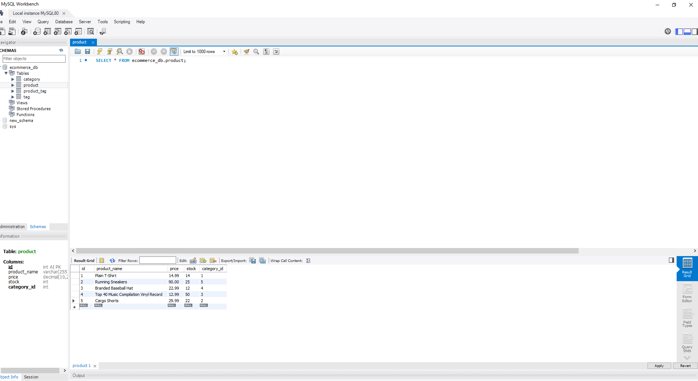
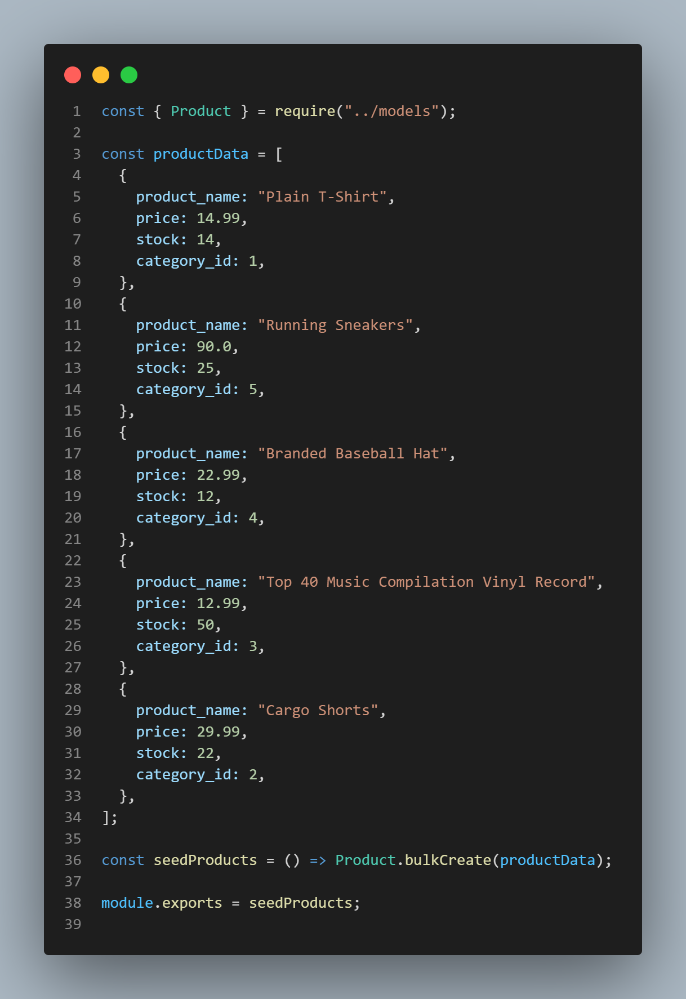

# E-commerce 

## Description:

For this project, my aim was to create an E-commerce back end which uses Express.js to interact with a MySQL work-bench database using sequelize.

## Links:

Demo:

- Part 1: https://drive.google.com/file/d/1CYIUn27Tl5pvoZrN-Ie_k5D6zrutnlr9/view?usp=sharing

- Part 2: https://drive.google.com/file/d/1j8Plvz4pxFPTDs6lAK8jfO7G-lurgZgs/view?usp=sharing

Github:
https://github.com/AsmaaMusse/orm-e-commerce

## Technologies Used:

- Javascript
- Node.js
- Express
- Sequelize

## Usage:
### Installation

```
git@github.com:AsmaaMusse/orm-e-commerce.git
cd orm-e-commerce
npm install / npm i
```

### Start

```
npm run start
```

### Seed

```
npm run seed
```

## Screenshots:





## Contribute

To contribute or ask questions, please <a href="https://mail.google.com/mail/u/0/?tf=cm&to=asmaamusse03@gmail.com&cc&bcc&su&body&fs=1">Email</a> here
